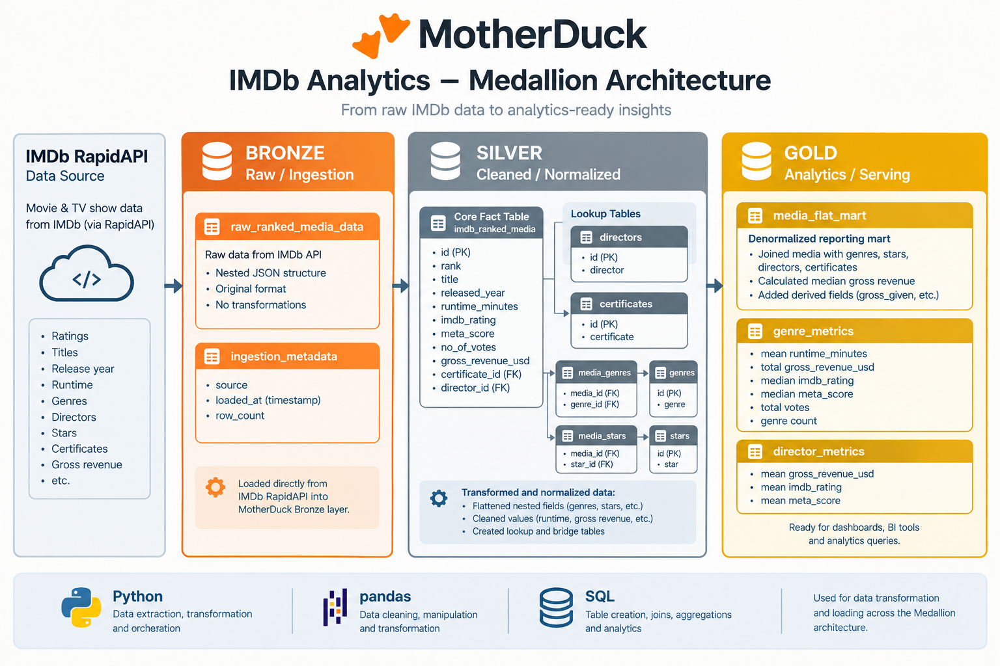
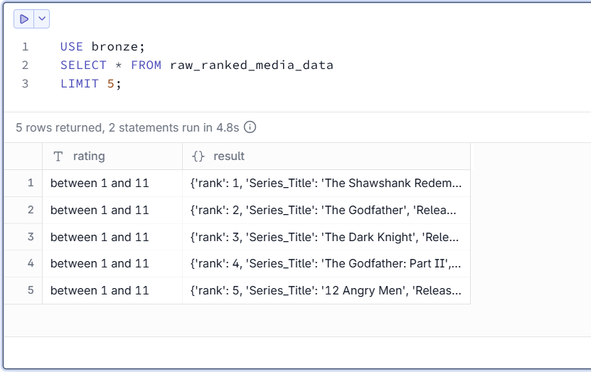
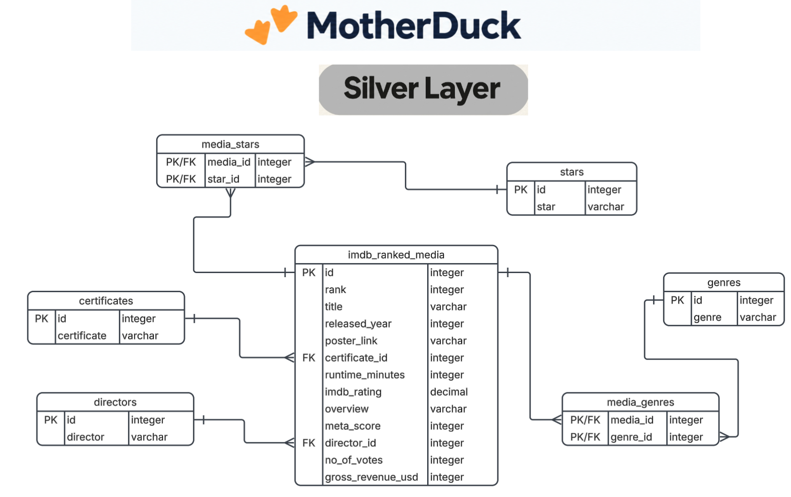
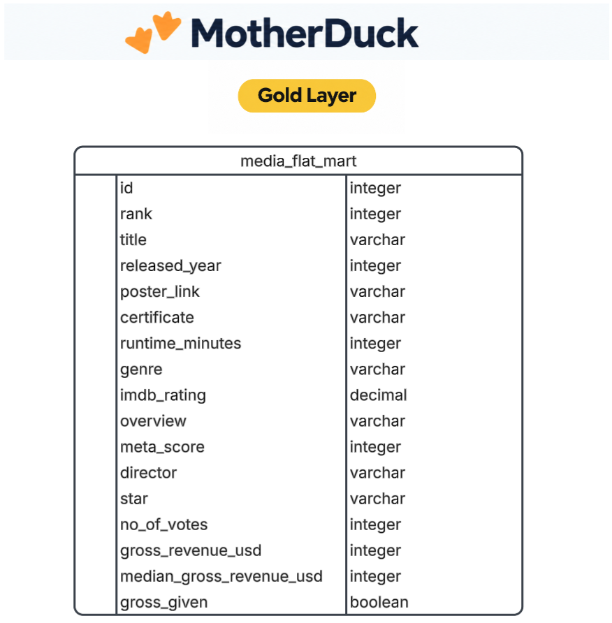
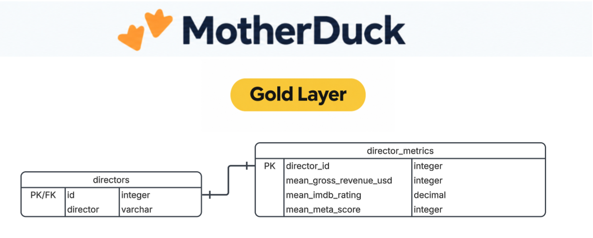
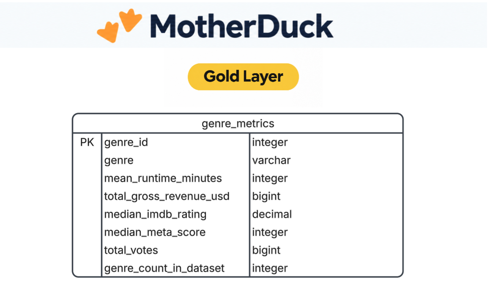

# 🎬 IMDb Top 1000 Movies & Series Medallion Data Pipeline


This project is an end-to-end data engineering pipeline that extracts top-ranked media records from the **IMDb Top 1000 RapidAPI service**, transforms and normalises the data using Python, Pandas, and DuckDB SQL, and loads it across a **Medallion Architecture (Bronze, Silver, Gold)** hosted on **MotherDuck**.

The pipeline ingests a raw nested JSON payload into the Bronze layer, normalises multi-valued attributes into standard relational lookup tables, bridge tables, and fact tables within a Silver layer, and builds aggregated metric tables and a flattened data mart in the Gold layer for downstream analytics.



## Project Overview

* **Pipeline scope:** Complete ELT pipeline processing IMDb top-ranked movies and series through Medallion Architecture layers on MotherDuck.
* **Data extraction:** Retrieves ranked media data via HTTP POST requests from the IMDb RapidAPI endpoint.
* **Medallion Data Architecture:** Segregates data into Bronze (raw ingestion & metadata), Silver (cleaned, normalized star/snowflake schema & bridge tables), and Gold (analytics-ready metrics & flat marts).
* **Data modelling:** Designed a normalized schema containing lookup dimension tables (`directors`, `stars`, `genres`, `certificates`), a central fact table (`imdb_ranked_media`), and many-to-many bridge tables (`media_stars`, `media_genres`).
* **ELT development:** Implemented automated extraction, cleaning, string unnesting, numeric parsing, surrogate key mapping, and metric aggregations using Python, Pandas, and DuckDB SQL.
* **Data integrity:** Implemented primary keys, unique constraints, sequence-based surrogate keys, and foreign keys across transaction-wrapped pipeline steps.
* **Validation:** Automatically tracks ingestion runs with sequence-driven IDs, UTC timestamps, and row counts in a dedicated `ingestion_metadata` table.
* **Automation:** Uses a master orchestration script (`run_pipeline.py`) to execute all pipeline functions sequentially.
* **Analytics-ready delivery:** Exposes a read-only MotherDuck database share and pre-aggregated director and genre metrics tables.

---

# 🧩 Problem & Context

**Problem:** Raw movie and television datasets sourced from public APIs typically have a nested structure arrays or comma-separated strings (e.g., `"Genre": "Action, Crime, Drama"`, `"Star1"..."Star4"` spread across multiple columns). Storing this raw payload in a single flat table results in significant data duplication, inconsistent data types and difficult querying for analysts.

**Solution:** I developed an ELT pipeline to retrieve the IMDb top 1000 IMDb Top 1000 Movies & Series from 2025, preserve raw JSON payloads in a Bronze layer with ingestion metadata, systematically clean and unnest entities into a relational Silver layer (with bridge tables handling many-to-many relationships for genres and actors), and aggregate key business metrics into a Gold layer data mart.

The pipeline creates a central `imdb_ranked_media` fact table connected to related lookup dimension tables via foreign keys, along with `media_stars` and `media_genres` bridge tables in the silver layer.

**Relevant code:** 

* [`run_pipeline.py`](imdb-rapidapi-elt-pipeline/run_pipeline.py) - Master pipeline orchestration
* [`bronze_ingestion.py`](imdb-rapidapi-elt-pipeline/bronze_ingestion.py) - API extraction, Bronze raw table loading, and metadata logging
* [`silver_create_tables.py`](imdb-rapidapi-elt-pipeline/silver_create_tables.py) - DDL script for sequence, constraint, lookup, fact, and bridge table creation
* [`silver_load_into_tables.py`](imdb-rapidapi-elt-pipeline/silver_load_into_tables.py) - Data transformation, unnesting, surrogate key mapping, and Silver loading
* [`gold_load_into_flat_mart.py`](imdb-rapidapi-elt-pipeline/gold_load_into_flat_mart.py) - Creation of the flattened analytical data mart
* [`gold_load_director_tables.py`](imdb-rapidapi-elt-pipeline/gold_load_director_tables.py) - Aggregation of director-level performance metrics
* [`gold_load_into_genre_metrics_table.py`](imdb-rapidapi-elt-pipeline/gold_load_into_genre_metrics_table.py) - Aggregation of genre-level runtime, revenue, and score metrics

---

# 🛠️ Tech Stack Used

* 🎬 **Data Source:** IMDb Top 1000 Movies & Series RapidAPI
* 🐍 **Languages:** Python, SQL
* 🐼 **Data Processing:** Pandas, NumPy, duckdb
* 🦆 **Database & OLAP Engine:** DuckDB
* ☁️ **Cloud Data Warehouse:** MotherDuck
* 🌐 **API Requests:** Python Requests
* 📄 **Environment Configuration:** Python-dotenv
* 🛠️ **Development:** VS Code + Jupyter Notebooks
* 📦 **Version Control:** Git/GitHub

---

# 🏗️ Pipeline Architecture


## Pipeline Stages and Development

### 🛠️ Exploratory data analysis 

Before pipeline development began, exploratory analysis was conducted in Jupyter Notebooks (`bronze_exploration.ipynb`) to assess structural anomalies, evaluate missingness across attributes (such as `Certificate`, `Meta_score`, and `Gross`), identify duplicate title entries (e.g., dual releases of *Drishyam* in 2013 and 2015), and evaluate data distribution across genres and certificates.

---

### 1. Extract & Ingest — Bronze Layer

The first stage grabs top-ranked media data from the IMDb RapidAPI endpoint via an HTTP POST request and loads the structured JSON output directly into MotherDuck.

**Code:** [`bronze_ingestion.py`](imdb-rapidapi-elt-pipeline/bronze_ingestion.py)

The API request is executed using the RapidAPI parameters:

```python
response = requests.post(
    url,
    data=payload,
    headers=headers
)
response.raise_for_status()
raw_media_df = pd.DataFrame.from_dict(response.json())
```
It also outputs the HTTP status code for validation upon completion.



Raw IMDb data queried in MotherDuck.

The data is loaded into `imdb_analytics.bronze.raw_ranked_media_data`. Furthermore, an `ingestion_metadata` table tracks execution metadata using DuckDB sequences:

```sql
CREATE TABLE IF NOT EXISTS ingestion_metadata (
    load_id INTEGER DEFAULT nextval('ingestion_id_seq') PRIMARY KEY,
    source VARCHAR,
    loaded_at TIMESTAMPTZ DEFAULT CURRENT_TIMESTAMP,
    row_count INTEGER
);
```

---

### 2. Create Relational Schema — Silver Layer

The second stage defines the Silver layer DDL within MotherDuck. It drops and replaces legacy tables and sets up DuckDB sequences for automatic surrogate key generation across entity tables.



**Code:** [`silver_create_tables.py`](imdb-rapidapi-elt-pipeline/silver_create_tables.py)

The following tables are created:

* `directors`
* `certificates`
* `stars`
* `genres`
* `imdb_ranked_media`
* `media_stars`
* `media_genres`

The lookup tables use generated sequence columns (`START 1`) as primary keys, while unique constraints are used to prevent duplicate values from being inserted.

The `imdb_ranked_media` table acts as the central fact table containing foreign keys connecting to `certificates` and `directors`. The `media_stars` and `media_genres` tables act as bridge tables with composite primary keys.

---

### 3. Load Lookup / Dimension & Fact Tables — Silver Layer

The third stage loads the lookup, fact, and bridge data extracted from the Bronze layer into Silver.

**Code:** [`silver_load_into_tables.py`](imdb-rapidapi-elt-pipeline/silver_load_into_tables.py)

The script performs string unnesting, deduplication, and parsing before insertion:

```python
def unnest_string(series):
    nested_string_list = list(series.dropna().drop_duplicates())
    unnested_string_list = []
    for val in nested_string_list:
        val_list = val.split(', ')
        for item in val_list:
            unnested_string_list.append(item)
    return pd.Series(unnested_string_list).drop_duplicates().to_frame(name="genre")
```

This stage also handles numeric type conversion and ID mapping:
* `Runtime` strings (e.g., `"142 min"`) are split and parsed to integers (`142`).
* `Gross` revenue strings (e.g., `"28,341,469"`) are stripped of commas and cast to integers.
* `Certificate` and `Director` strings are matched against lookup DataFrames to retrieve foreign key IDs.

---

### 4. Aggregations & Analytical Marts — Gold Layer

The fourth stage builds analytical data marts in the Gold schema to facilitate reporting and dashboarding.



* [`gold_load_into_flat_mart.py`](imdb-rapidapi-elt-pipeline/gold_load_into_flat_mart.py) : Denormalizes movies, stars, directors, genres, and certificates while adding window function metrics (such as dataset-wide `MEDIAN(gross_revenue_usd) OVER()`).

--- 


* [`gold_load_director_tables.py`](imdb-rapidapi-elt-pipeline/gold_load_director_tables.py): Aggregates mean gross revenue, mean IMDb rating, and mean Metascore per director.

--- 

* [`gold_load_into_genre_metrics_table.py`](imdb-rapidapi-elt-pipeline/gold_load_into_genre_metrics_table.py): Aggregates mean runtime, total gross revenue, median IMDb rating, median Metascore, total votes, and movie count per genre.

---
# 🗂️ Database Schema

This is the entire database medallion architecture.


# 🔎 Lookup & ID Matching

Once the dimension tables were populated, the fact-table pipeline retrieves their IDs by matching records against the lookup DataFrames.

**Code:** [`silver_load_into_tables.py`](imdb-rapidapi-elt-pipeline/silver_load_into_tables.py)

For example, the certificate and director names from a record are matched against their respective DataFrames:

```python
temp_cert_id_list = list(certs_df[media_df.iloc[i]["Certificate"] == certs_df["certificate"]]["id"])
if len(temp_cert_id_list) == 1:
    cert_id = temp_cert_id_list[0]
else:
    cert_id = None
```

If a matching ID exists, it is assigned to the foreign-key field. If no match is found or the value is missing, it is set to `None`.

The same approach was used for mapping entries into the `media_stars` and `media_genres` bridge tables.


# ⏱️ Timestamp Tracking

The `ingestion_metadata` table tracks ingestion run details, and each script logs its completion time in UTC.

**Code:** [`bronze_ingestion.py`](imdb-rapidapi-elt-pipeline/bronze_ingestion.py)

```sql
loaded_at TIMESTAMPTZ DEFAULT CURRENT_TIMESTAMP
```

In Python, execution completion is captured using:

```python
timestamp = datetime.datetime.now(datetime.timezone.utc)
```


# ⚙️ Pipeline Orchestration

The complete ELT process is controlled by the master orchestration script.

**Code:** [`run_pipeline.py`](imdb-rapidapi-elt-pipeline/run_pipeline.py)

The pipeline stages execute sequentially:

```text
STEP 1: INGEST DATA INTO BRONZE LAYER
        │
        ▼
STEP 2: CREATE TABLES IN SILVER LAYER
        │
        ▼
# STEP 3: LOAD DATA INTO SILVER LAYER TABLES
        │
        ▼
# STEP 4: LOAD DATA INTO GOLD LAYER TABLES
```

# 📊 BI & Analytical Use

The MotherDuck database can be connected to analytical and visualisation tools such as:

* 📊 Power BI / Tableau
* 🦆 DuckDB CLI / MotherDuck UI
* 🐍 Python / Pandas / Jupyter Notebooks

### Querying the Shared Database

To query the production database directly in **MotherDuck**, attach the shared database using SQL:

```sql
ATTACH 'md:_share/imdb_analytics_for_viewers/19a9b5f7-1b71-4360-8b4d-978a5942f65f';
```

*(Note: This shared database instance is read-only for external analytical exploration).*


# ⚙️🛠️ Data Engineering Skills Demonstrated

### ELT Pipeline Development

* **Extract:** Retrieve top-ranked media data from the IMDb RapidAPI service
* **Transform:** Clean, unnest strings, handle missing values, and convert types using Pandas
* **Load:** Insert transformed data across Bronze, Silver, and Gold layers in MotherDuck
* **Orchestration:** Execute multiple ELT stages sequentially via a single master script
* **Validation:** HTTP status checks, database row counts, and audit logging

### Database Design & Architecture

* Medallion Architecture (Bronze, Silver, Gold layers)
* Normalised relational schema (Star/Snowflake hybrid)
* Fact, dimension, and junction/bridge tables
* Primary keys, foreign keys, unique constraints, and sequences
* Explicit transactional management (`BEGIN TRANSACTION / COMMIT`)

### Python & SQL

* Reusable modular Python functions for each stage
* Pandas DataFrames for complex array/string transformations
* DuckDB Python API for cloud data warehouse interactions
* SQL DDL for database schema and sequence creation
* SQL DML and window functions (`MEDIAN() OVER()`) for analytical aggregations

### Production Practices

* Environment variables (`python-dotenv`) for credentials management
* Comprehensive metadata logging and timestamping (UTC)
* Modular pipeline architecture
* Public read-only data sharing via MotherDuck shares


# ⛔ Project Limitations

* Orchestration: The `run_pipeline.py` file must be manually run instead of automatically scheduled using an orchestrator like Airflow.
