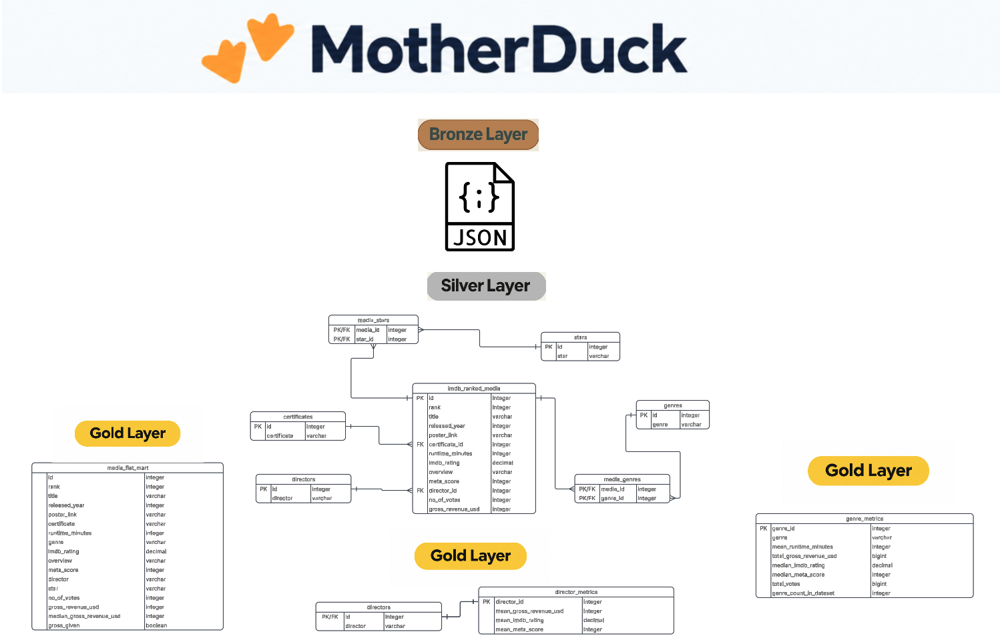

## 🛠️ Pipeline Execution

Run the complete data pipeline with a single script.


Select **`run_pipeline.py`** to execute all data pipeline scripts in sequence.

### 🗄️ Database Schema

The diagram below provides an overview of the complete database schema, including the relationships between the tables.



### 🦆 Querying the Database with MotherDuck

To query the database directly in **MotherDuck**, first attach the shared database using the following SQL command:

```sql
ATTACH 'md:_share/imdb_analytics_for_viewers/19a9b5f7-1b71-4360-8b4d-978a5942f65f';
```
This shared database is read-only. You can run queries to explore and analyse the data, but you cannot modify the database or its tables.